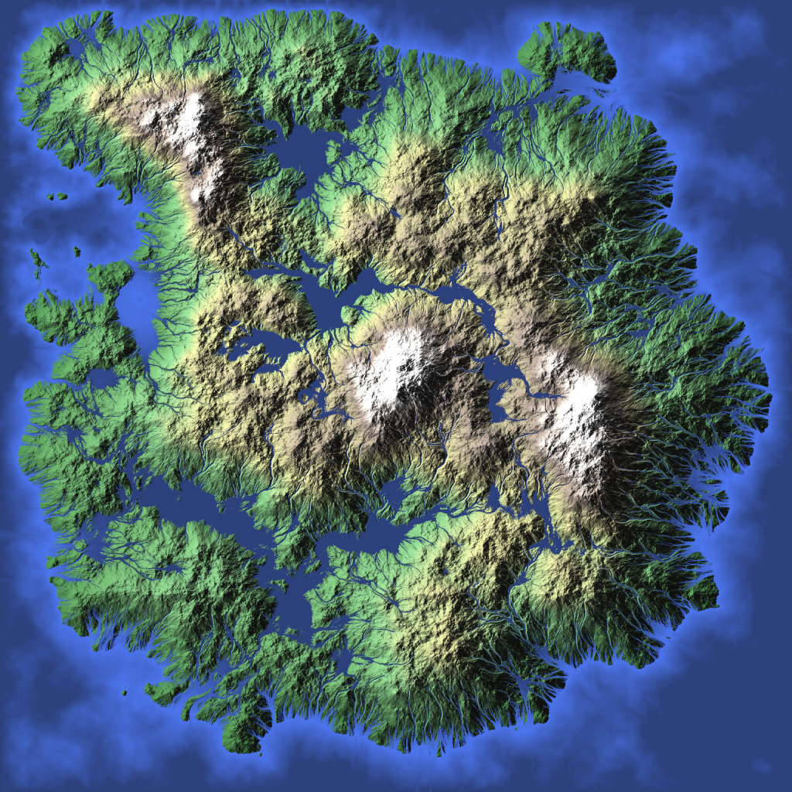

# Research.Erosion

Репозиторий кода [исследования](https://unicornum.github.io/Research.Erosion/index.html)
различных реализаций эрозии заранее сгенерированной карты высот.

> Код в данном репозитории собирался 'на коленке' - для того, чтобы можно было 
> быстро посмотреть и оценить результат и не претендует на полноту, корректность,
> качесто и прочее.

> Все права на код принадлежать авторам, лицензии ищите в первоисточниках.

## Использование

- Для сборки используется Visual Studio 2022.
- Симуляция производится сборкой и запуском проекта **Research.Erosion**.
- Для выбора разрешения используемой карты высот определить макрос SET_SIZE_XXXX
в файле Research.Erosion.cpp.
- Выбор реализации симуляции производится раскомментированием вызова
соответствующей функции в файле Research.Erosion.cpp.
- Исходным файлом, содержащим карту высот, является файл Source_XXXXxXXXX.tiff
в папке Solution/Solution/Pictures (одноканальный файл в оттенках серого,
содержит значения float в 'натуральную величину').
- Результат обработки записывается в файл Result_XXXXxXXXX.tiff в папке
Solution/Solution/Pictures (одноканальный файл в оттенках серого,
содержит нормализованные значения float).
- Дополнительно формируется файл Colors_XXXXxXXXX.tiff (RGBA файл в цвете,
зависящем от значения на полученной карте высот + освещение).

## Дополнительно

### Ссылки

- [pyton] [Three Ways of Generating Terrain with Erosion Features](https://github.com/dandrino/terrain-erosion-3-ways)
- [C++/pyton] [Geomorphology Simulation Library and Toolbox](https://github.com/erosiv/soillib)
- [go] [Terrain Generation: River Networks](https://janert.me/blog/2024/terrain-generation-river-networks/)
- [C++] [Simulation, Modeling and Authoring of Glaciers](https://github.com/oargudo/glaciers)
- [C++] [Desertscape Simulation](https://github.com/aparis69/Desertscapes-Simulation)
- [C++] [Procedural Wind Erosion](https://github.com/weigert/SimpleWindErosion)
- [pyton] [Orometry-based Terrain Analysis and Synthesis](https://github.com/oargudo/orometry-terrains)
- [C++] [Large-scale terrain authoring through interactive erosion simulation](https://github.com/H-Schott/StreamPowerErosion)

### Статьи

- [Realtime Procedural Terrain Generation](https://web.mit.edu/cesium/Public/terrain.pdf)
- [Terrain Amplification With Implicit 3D Features](https://aparis69.github.io/public_html/projects/paris2019_3D.html)
- [Meander is a procedural system for generating historical maps of rivers that never existed](https://roberthodgin.com/project/meander)
- [Meandering River - code exploration & simulation](https://vimeo.com/107158489)
- [Procedural Hydrology: Improvements and Meandering Rivers in Particle-Based Hydraulic Erosion Simulations](https://nickmcd.me/2023/12/12/meandering-rivers-in-particle-based-hydraulic-erosion-simulations/)
- [Procedural Hydrology: Dynamic Lake and River Simulation](https://nickmcd.me/2020/04/15/procedural-hydrology/)
- [An Efficient Data Structure for 3D Multi-Layer Terrain and Erosion Simulation](https://nickmcd.me/2022/04/15/soilmachine/)
- [Simple Particle-Based Wind Erosion](https://nickmcd.me/2020/11/23/particle-based-wind-erosion/)
- [Procedural Terrain Generation](https://filipalexjoel.wordpress.com/)
- [Terrain Erosion](https://3dworldgen.blogspot.com/2017/12/terrain-erosion.html)
- [Terrain Generation Using Procedural Models Based on Hydrology](https://www.cs.purdue.edu/cgvlab/www/resources/papers/Genevaux-ACM_Trans_Graph-2013-Terrain_Generation_Using_Procedural_Models_Based_on_Hydrology.pdf)
- [Генерация террайнов, эрозия, реки и т.п.](https://aparis69.github.io/public_html/publications.html)
